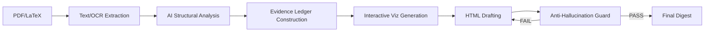

<div align="center">

# Paper Visual Reader v5.1

**Transform academic papers into interactive, evidence-gated HTML digests that are more informative than the original paper.**

[English](#english) | [中文](#中文) | [Español](#español)


</div>

---

<a name="english"></a>

## English

### What It Does

Paper Visual Reader converts PDF/LaTeX academic papers into standalone HTML digests. Unlike summaries, these digests are **technically dense and evidence-gated**, designed to be more informative than reading the original paper by adding intuition, interactive visualizations, and strict factual grounding.

### Core Value Proposition (v5.0)

- **Interactive Visualization Module**: Automatically generates Canvas-driven widgets (Belief partitions, Simplex heatmaps, Payoff spaces) to build geometric intuition for formal results.
- **Evidence Gating & Anti-Hallucination**: Every claim is traced to a specific source anchor. A deterministic "Guard" blocks ungrounded content before delivery.
- **Premium Academic Template**: A minimalist, high-contrast 3-panel layout (Sidebar TOC + Main Content + Right Margin Panel) using `Crimson Pro` serif typography.
- **Interpretation Mandate**: Every formal result includes a plain-English restatement, >=100 words of intuition, and literature context.

### Features

- **5 Specialized Templates**: `premium_academic` (default), `theory`, `empirical`, `review/survey`, and `comparative`.
- **KaTeX Math Rendering**: Full LaTeX support with automatic overflow protection for long equations.
- **Right Margin Panel**: At-a-glance stats, evidence quality meter, key notation quick-reference, and dynamic section indicators.
- **Interactive UI**: Section search, notation glossary modal, and smooth-scroll TOC with active tracking.

### Quick Start

```bash
paper-visual-reader /path/to/paper.pdf --template premium_academic --detail premium
```

**Output Structure:**
- `digest.html`: Self-contained interactive visual digest.
- `evidence_ledger.json`: Claim-level source mapping and confidence scores.
- `guard_report.md`: human-readable anti-hallucination validation report.

### Detail Levels

| Level | Word Count | Interpretation | Proofs |
|-------|-----------|----------------|--------|
| standard | 1/2 of source | Main results only | Sketch |
| **premium** | 2/3 of source | All results + Intuition | Strategy + key steps |
| deep | Full reproduction | Exhaustive analysis | Full reproduction |

### Internal Architecture



---

## Anti-Hallucination Guard

Every digest passes through a 15-round deterministic verification protocol before delivery. Rounds 1-12 cover structural integrity, evidence-ledger completeness, claim grounding, and per-claim semantic content checks. Rounds 13-15 are the semantic purity layer added in v5.1.

### Semantic Purity Checks (v5.1+)

Three new rounds added to prevent garbage digests that pass structural checks:

**Round 13: Raw Text Injection Detection**
- Measures fraction of 15-gram windows in digest that exactly match source text
- WARN at >40% overlap, FAIL at >65%
- Detects the "source dump" attack: pasting extracted paper text directly into HTML

**Round 14: Interpretation Density**
- Checks that `.interpretation-box`/`.analysis-box`/`.intuition` elements contain >=15% of total digest words
- Per-card check: result cards >=80 words must have at least one interpretation child
- Exempts digests that never use this CSS convention (legacy-safe)

**Round 15: Vocabulary Diversity**
- Computes type-token ratio (unique words / total words)
- WARN at TTR <0.20, FAIL at TTR <0.12
- Detects padding via low-quality word repetition

---

<a name="中文"></a>

## 中文 (Chinese)

### 核心功能

Paper Visual Reader 将 PDF/LaTeX 学术论文转换为独立的 HTML 可视化摘要。与普通摘要不同，产出的摘要具有**极高的技术密度与证据约束**，旨在通过加入直观解读、交互式可视化和严格的事实溯源，使其比阅读论文原文更有信息量。

### 5.0 版本核心价值

- **交互式可视化模块**：自动生成基于 Canvas 的交互小部件（如信念划分、单纯形热力图、支付空间图），建立对形式化结果的几何直觉。
- **证据分级与反幻觉**：每个论断都追溯到特定的源文锚点。确定性“守卫”在交付前强力拦截无依据的内容。
- **Premium Academic 模板**：极简、高对比度的三栏布局（左侧目录 + 中间内容 + 右侧边注），使用 `Crimson Pro` 衬线字体。
- **强力解读机制**：每个定理/引理必须包含：通俗重述、不少于 100 字的直觉解释、以及文献背景。

### 核心特性

- **5 种专业模板**：`premium_academic` (默认)、`theory` (理论)、`empirical` (实证)、`review` (综述)、`comparative` (对比)。
- **KaTeX 数学渲染**：完整 LaTeX 支持，具备长公式自动溢出保护。
- **右侧面板**：提供论文统计、证据质量仪表盘、关键符号速查。
- **动态交互**：章节过滤、符号表模态框、带活跃追踪的平滑目录。

### 快速开始

```bash
paper-visual-reader /path/to/paper.pdf --template theory --detail premium
```

### 详细程度控制

| 级别 | 字数地板 | 解读深度 | 证明要求 |
|------|---------|---------|---------|
| standard | 原文 1/2 | 核心结果 | 证明思路 |
| **premium** | 原文 2/3 | 全部结果 + 核心直觉 | 策略 + 关键步骤 |
| deep | 完整复现 | 极深度分析 | 完整推导 |

---

<a name="español"></a>


### Arquitectura

```
ENTRADA -> EXTRAER_TEXTO -> ANALISIS IA -> CONSTRUIR_LIBRO_EVIDENCIA -> GENERAR_HTML -> EJECUTAR_GUARDIAN
```

El agente IA lee el articulo completo, extrae todos los resultados formales, construye un libro de evidencia a nivel de afirmacion, genera el resumen HTML y luego valida todo a traves del guardian anti-alucinacion. Si el guardian devuelve FAIL, el agente itera hasta obtener PASS.

### Diseno de la plantilla Premium Academic

La plantilla por defecto presenta un diseno de tres columnas optimizado para pantallas anchas:

- **Barra lateral izquierda** (280px): Indice fijo con seguimiento de seccion activa
- **Contenido principal** (flexible, max 860px): Secciones, tarjetas de afirmaciones, bloques de ecuaciones, cajas de interpretacion
- **Panel derecho** (260px): Estadisticas del articulo, medidor de calidad de evidencia, contribuciones clave, referencia rapida de notacion, indicador dinamico de seccion

El panel derecho se oculta por debajo de 1200px. Por debajo de 768px, el diseno cambia a una sola columna para moviles.

---

## Changelog / 更新日志 / Historial de cambios

### v5.1 (2026-03-25)

**English:**
- R12: Per-claim semantic content grounding (token overlap, 4-gram grounding, sentence similarity)
- R13: Raw text injection detection (15-gram verbatim copy detection)
- R14: Interpretation density enforcement (per-card and global checks)
- R15: Structural diversity / type-token ratio padding detection
- Anti-hallucination guard upgraded from 11-round to 15-round verification protocol
- All 11 guard fixtures + 5 pipeline e2e tests + 3 regression checks pass

**中文：**
- R12：逐 claim 语义内容溯源（词重叠率、4-gram 溯源分数、句子相似度下限）
- R13：原文注入检测（15-gram 滑窗逐字复制检测）
- R14：解读密度强制检查（全局 + 逐卡片级别）
- R15：结构多样性 / 类型-标记比检测（防重复填充）
- 反幻觉守卫从 11 轮升级为 15 轮验证协议
- 全部 11 个守卫测试 + 5 个端到端管线测试 + 3 个回归测试通过

**Espanol:**
- R12: Fundamentacion semantica por afirmacion (solapamiento de tokens, score 4-gram, similitud de oraciones)
- R13: Deteccion de inyeccion de texto sin procesar (deteccion de copia verbatim 15-gram)
- R14: Aplicacion de densidad de interpretacion (verificaciones por tarjeta y globales)
- R15: Diversidad estructural / deteccion de relleno por ratio tipo-token
- Guardian anti-alucinacion actualizado de protocolo de 11 rondas a 15 rondas
- Todas las 11 pruebas de guardian + 5 pruebas e2e + 3 pruebas de regresion pasan

### v5.0 (2026-03-24)

**English:**
- Cross-reference popup system for named mathematical objects (Proposition, Theorem, Lemma, Corollary, Assumption, Definition)
- Inline proof blocks (collapsible, under each proposition, not in a separate appendix)
- Playground visualization type (click-to-draw custom functions, real-time computation, parameter sliders)
- Enhanced canvas rendering (gradient fills, shadow dots, hover tooltips, DPR-aware scaling)

**中文：**
- 交叉引用弹窗系统：点击命题/定理/引理/推论/假设/定义编号，弹出浮动卡片显示完整声明（支持 KaTeX 渲染）
- 内联证明块：可折叠的证明直接嵌入对应命题的卡片内部，不再放在独立附录中
- Playground 可视化类型：点击绘制自定义函数，实时计算变换（如 concavification），参数滑块调节
- Canvas 渲染增强：渐变填充、阴影圆点、悬停坐标提示、DPR 缩放适配

**Espanol:**
- Sistema de popups de referencias cruzadas para objetos matematicos (Proposicion, Teorema, Lema, Corolario, Supuesto, Definicion)
- Bloques de prueba en linea (colapsables, bajo cada proposicion, no en un apendice separado)
- Tipo de visualizacion Playground (dibujar funciones personalizadas, computacion en tiempo real, controles deslizantes)
- Renderizado de canvas mejorado (rellenos degradados, puntos con sombra, tooltips al pasar el cursor, escalado DPR)

### v4.0

**English:**
- Interactive Visualization Module with 8 viz types
- Canvas/SVG inline visualizations

**中文：**
- 交互可视化模块，含 8 种可视化类型
- Canvas/SVG 内联可视化

**Espanol:**
- Modulo de visualizacion interactiva con 8 tipos
- Visualizaciones en linea Canvas/SVG

### v3.0

**English:**
- Premium Academic 3-panel template
- Anti-hallucination guard (15-round verification)
- Evidence ledger schema

**中文：**
- Premium Academic 三栏模板
- 反幻觉守卫（11 轮验证）
- 证据台账 schema

**Espanol:**
- Plantilla academica Premium de 3 paneles
- Guardia anti-alucinacion (verificacion de 11 rondas)
- Esquema de libro de evidencia

### v2.0

**English:**
- Right margin panel
- Theory/empirical/review template specialization

**中文：**
- 右侧边栏面板
- 理论/实证/综述模板特化

**Espanol:**
- Panel de margen derecho
- Especializacion de plantillas teoria/empirica/revision

### v1.0

**English:**
- Initial release with basic HTML digest generation

**中文：**
- 初始版本，基础 HTML 摘要生成

**Espanol:**
- Version inicial con generacion basica de resumen HTML

---

<div align="center">

Built for researchers who want to understand papers deeply, not just skim them.

</div>
