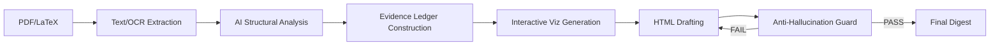

<div align="center">

# Paper Visual Reader v4.0

**Transform academic papers into interactive, evidence-gated HTML digests that are more informative than the original paper.**

[English](#english) | [中文](#中文) | [Español](#español)


</div>

---

<a name="english"></a>

## English

### What It Does

Paper Visual Reader converts PDF/LaTeX academic papers into standalone HTML digests. Unlike summaries, these digests are **technically dense and evidence-gated**, designed to be more informative than reading the original paper by adding intuition, interactive visualizations, and strict factual grounding.

### Core Value Proposition (v4.0)

- **Interactive Visualization Module**: Automatically generates Canvas-driven widgets (Belief partitions, Simplex heatmaps, Payoff spaces) to build geometric intuition for formal results.
- **Evidence Gating & Anti-Hallucination**: Every claim is traced to a specific source anchor. A deterministic "Guard" blocks ungrounded content before delivery.
- **Premium Academic Template**: A minimalist, high-contrast 3-panel layout (Sidebar TOC + Main Content + Right Margin Panel) using `Crimson Pro` serif typography.
- **Interpretation Mandate**: Every formal result includes a plain-English restatement, >=100 words of intuition, and literature context.

### Features

- **5 Specialized Templates**: `premium_academic` (default), `theory`, `empirical`, `review/survey`, and `comparative`.
- **KaTeX Math Rendering**: Full LaTeX support with automatic overflow protection for long equations.
- **Right Margin Panel**: At-a-glance stats, evidence quality meter, key notation quick-reference, and dynamic section indicators.
- **Interactive UI**: Section search, notation glossary modal, and smooth-scroll TOC with active tracking.

### Quick Start

```bash
paper-visual-reader /path/to/paper.pdf --template premium_academic --detail premium
```

**Output Structure:**
- `digest.html`: Self-contained interactive visual digest.
- `evidence_ledger.json`: Claim-level source mapping and confidence scores.
- `guard_report.md`: human-readable anti-hallucination validation report.

### Detail Levels

| Level | Word Count | Interpretation | Proofs |
|-------|-----------|----------------|--------|
| standard | 1/2 of source | Main results only | Sketch |
| **premium** | 2/3 of source | All results + Intuition | Strategy + key steps |
| deep | Full reproduction | Exhaustive analysis | Full reproduction |

### Internal Architecture



---

<a name="中文"></a>

## 中文 (Chinese)

### 核心功能

Paper Visual Reader 将 PDF/LaTeX 学术论文转换为独立的 HTML 可视化摘要。与普通摘要不同，产出的摘要具有**极高的技术密度与证据约束**，旨在通过加入直观解读、交互式可视化和严格的事实溯源，使其比阅读论文原文更有信息量。

### 4.0 版本核心价值

- **交互式可视化模块**：自动生成基于 Canvas 的交互小部件（如信念划分、单纯形热力图、支付空间图），建立对形式化结果的几何直觉。
- **证据分级与反幻觉**：每个论断都追溯到特定的源文锚点。确定性“守卫”在交付前强力拦截无依据的内容。
- **Premium Academic 模板**：极简、高对比度的三栏布局（左侧目录 + 中间内容 + 右侧边注），使用 `Crimson Pro` 衬线字体。
- **强力解读机制**：每个定理/引理必须包含：通俗重述、不少于 100 字的直觉解释、以及文献背景。

### 核心特性

- **5 种专业模板**：`premium_academic` (默认)、`theory` (理论)、`empirical` (实证)、`review` (综述)、`comparative` (对比)。
- **KaTeX 数学渲染**：完整 LaTeX 支持，具备长公式自动溢出保护。
- **右侧面板**：提供论文统计、证据质量仪表盘、关键符号速查。
- **动态交互**：章节过滤、符号表模态框、带活跃追踪的平滑目录。

### 快速开始

```bash
paper-visual-reader /path/to/paper.pdf --template theory --detail premium
```

### 详细程度控制

| 级别 | 字数地板 | 解读深度 | 证明要求 |
|------|---------|---------|---------|
| standard | 原文 1/2 | 核心结果 | 证明思路 |
| **premium** | 原文 2/3 | 全部结果 + 核心直觉 | 策略 + 关键步骤 |
| deep | 完整复现 | 极深度分析 | 完整推导 |

---

<a name="español"></a>


### Arquitectura

```
ENTRADA -> EXTRAER_TEXTO -> ANALISIS IA -> CONSTRUIR_LIBRO_EVIDENCIA -> GENERAR_HTML -> EJECUTAR_GUARDIAN
```

El agente IA lee el articulo completo, extrae todos los resultados formales, construye un libro de evidencia a nivel de afirmacion, genera el resumen HTML y luego valida todo a traves del guardian anti-alucinacion. Si el guardian devuelve FAIL, el agente itera hasta obtener PASS.

### Diseno de la plantilla Premium Academic

La plantilla por defecto presenta un diseno de tres columnas optimizado para pantallas anchas:

- **Barra lateral izquierda** (280px): Indice fijo con seguimiento de seccion activa
- **Contenido principal** (flexible, max 860px): Secciones, tarjetas de afirmaciones, bloques de ecuaciones, cajas de interpretacion
- **Panel derecho** (260px): Estadisticas del articulo, medidor de calidad de evidencia, contribuciones clave, referencia rapida de notacion, indicador dinamico de seccion

El panel derecho se oculta por debajo de 1200px. Por debajo de 768px, el diseno cambia a una sola columna para moviles.

---

<div align="center">

Built for researchers who want to understand papers deeply, not just skim them.

</div>
